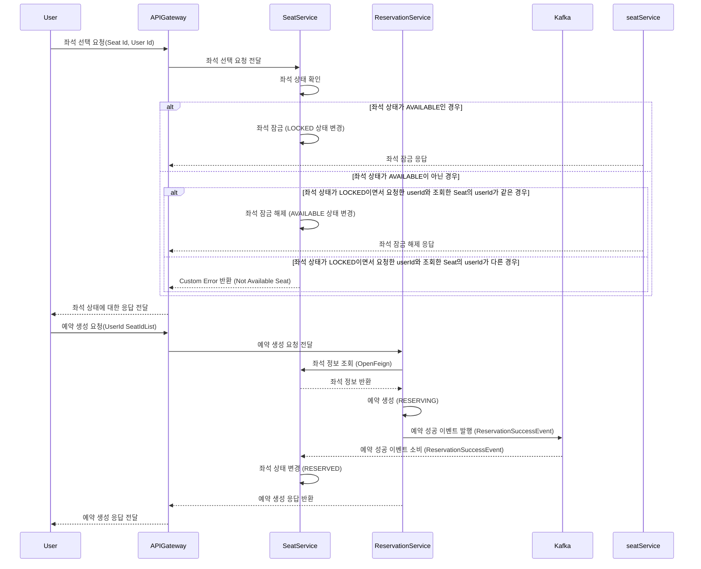
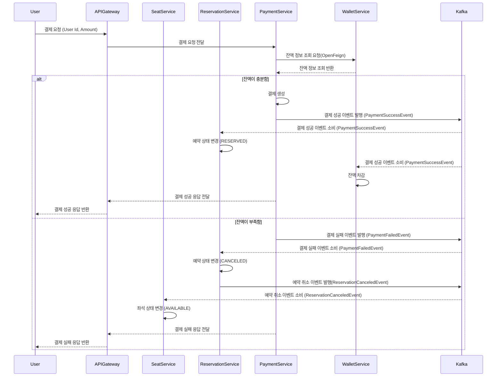

## 1. 좌석 조회 페이지 진입

### 이벤트 시퀀스 다이어그램
```mermaid
sequenceDiagram
    participant User
    participant APIGateway
    participant UserService
    participant ConcertService
    participant QueueService
    participant SeatService

    User->>APIGateway: 로그인 요청(Username, Password)
    APIGateway->>UserService: 로그인 요청 전달 (존재하는 회원 확인)
    UserService-->>APIGateway: 인증 결과 및 JWT 전달
    alt 인증 성공 (존재하는 회원)
        APIGateway-->>User: 로그인 성공 응답과 함께 JWT 반환
        User->>APIGateway: 콘서트 목록 조회 요청(제목, 날짜 등 검색 조건)
        APIGateway->>ConcertService: 콘서트 목록 조회 요청 전달
        ConcertService-->>APIGateway: 검색 조건에 맞는 콘서트 목록 전달
        APIGateway-->>User: 콘서트 목록 응답
        User->>APIGateway: 원하는 콘서트의 스케쥴 목록 조회 요청(Concert Id)
        APIGateway->>ConcertService: 스케쥴 목록 조회 요청 전달
        ConcertService-->>APIGateway: 콘서트의 스케쥴 목록 전달
        APIGateway-->>User: 스케쥴 목록 응답
        User->>APIGateway: 대기열 진입 요청(User Id, ConcertSchedule Id)
            APIGateway->>QueueService: 대기열 진입 요청 전달
        alt Active 대기열 진입 실패(현재 Active 대기열의 수>200)=>5초마다 재요청(polling)
            QueueService->>QueueService: Wait 대기열에 저장
            QueueService-->>APIGateway: 대기열 상태 전달
            APIGateway-->>User: Wait 상태 반환(예상 대기 시간, 순서 등)
        else Active 대기열 진입 성공(현재 Active 대기열의 수<=200)
            QueueService->>QueueService: Active 대기열에 저장
            QueueService-->>APIGateway: 대기열 상태 전달
            APIGateway-->>User: Active 상태 반환
            User->APIGateway: 원하는 스케쥴의 좌석 목록 요청(ConcertSchedule Id)
            APIGateway->>SeatService: 좌석 목록 요청 전달
            SeatService-->>APIGateway: 좌석 목록 전달
            APIGateway-->>User: 좌석 목록 응답
        end
    else 인증 실패 (존재하지 않는 회원)
        APIGateway-->>User: 오류 메시지 반환 (Not found User)
```
### Description

로그인과 회원가입을 제외한 모든 요청은 로그인을 하고 JWT를 발급받은 상태에서만 가능합니다.

콘서트 목록을 조회할 때는 검색 조건과 함께 요청하게 되며 조건에 맞는 콘서트 목록이 조회됩니다.

콘서트 스케쥴을 응답받고 해당 스케쥴의 좌석목록을 조회하기 위해서는 대기열에 진입해야 합니다.

반환 받은 대기열 상태에 따라 재요청을 할지 좌석조회 요청을 보낼지 정해집니다.

<br>

## 2. 좌석 예약

### 이벤트 시퀀스 다이어그램


### Description
조회한 좌석들의 목록 중 원하는 좌석을 선택할 시 해당 좌석에 대한 잠금 요청을 합니다.

좌석의 상태에 따라 좌석을 잠그거나 활성화합니다 이미 선택 중인 좌석이라면 예외를 던집니다.

선택된 좌석들에 대해서 예약을 진행합니다.

OpenFeign으로 Reservation 서비스에서 좌석의 정보를 조회하며 헤딩 정보들을 바탕으로 예약을 생성합니다.

예약에 성공할 시 Kafka 메시지를 발행하여 구독중인 Seat 서비스에서 해당하는 좌석의 상태를 RESERVED로 바꿉니다.

<br>

## 3. 결제

### 이벤트 시퀀스 다이어그램

### Description
좌석 예약에 이어 결제를 진행합니다.

결제에 성공하면 예약의 상태를 RESERVED로 변경하고 Wallet 서비스에서 잔액을 차감합니다

결제에 실패할 경우 SAGA 패턴을 이용한 분산 트랜잭션 방식으로 예약을 취소하고 좌석 상태를 롤백합니다.
<br>